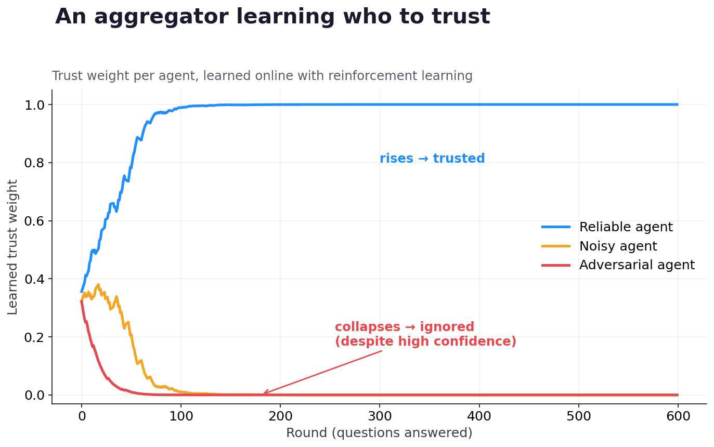

## Research question

When multiple language-model agents disagree, can an aggregation system learn **who to trust** instead of treating every vote as equally credible?

## Why majority voting is insufficient

Majority voting assumes that agents are interchangeable. That assumption breaks when an agent is systematically noisy, compromised by prompt injection, or confidently wrong. This project represents each agent as a bandit arm and updates its trust from observed correctness.

## Current experiment

The initial environment contains three agents:

| Agent | Behaviour | Learned trust with EMA |
|---|---|---:|
| Reliable | Usually correct | 0.54 |
| Noisy | Inconsistently correct | 0.34 |
| Adversarial | Confidently wrong | 0.12 |

Across 600 rounds, the EMA aggregator reached `0.907` accuracy and the gradient-bandit policy reached `0.910`. The gradient bandit eventually concentrated its selection probability on the reliable agent. These values are produced by the current seeded notebook, not manually entered estimates.

{fig-alt="Learned trust over time for reliable, noisy, and adversarial agents"}

## Reproduce the work

::: {.callout-note appearance="simple"}
The full notebook derives the reinforcement-learning foundations before applying them to agent trust. You can inspect the rendered version here, run it in Colab, or download the original notebook.
:::

[Read the rendered notebook](../../lab/reinforcement-learning-from-scratch.ipynb){.btn .btn-primary}
[Run in Colab](https://colab.research.google.com/github/MSirous/ml_from_scratch/blob/main/rl-trust-aware/RL_from_scratch.ipynb){.btn .btn-outline-light}
[View source](https://github.com/MSirous/ml_from_scratch/tree/main/rl-trust-aware){.btn .btn-outline-light}

## Next questions

- How should trust depend on the type of question rather than remain global?
- Can a strategic adversary rebuild trust before attacking?
- What changes when evaluation feedback is delayed or partially observed?

The theoretical foundations follow Sutton and Barto's treatment of multi-armed bandits and incremental action-value estimation [@sutton2018reinforcement].
